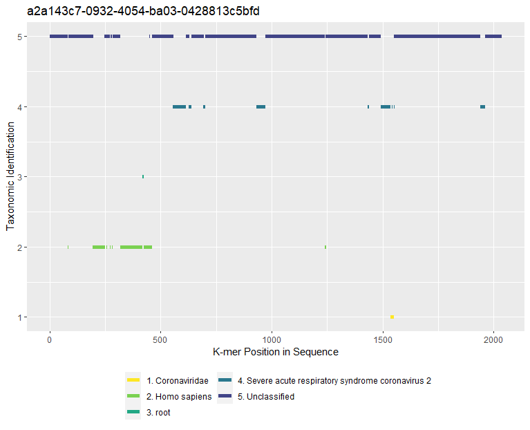
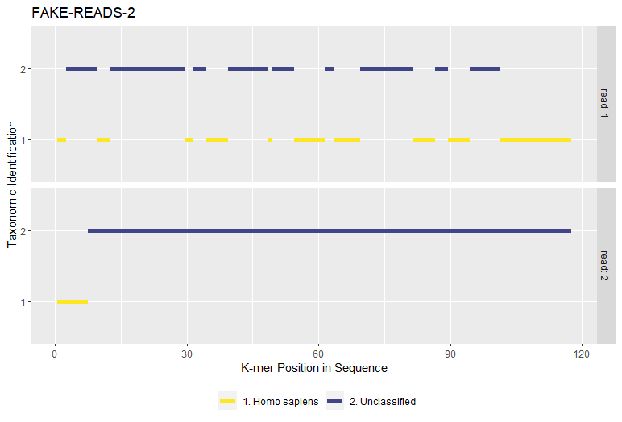

# krakenreports

## How to install: 

Create a conda environment and then run the following

```
sbatch -p NMLResearch -c 1 --mem=4G --wrap="wget -O - https://raw.githubusercontent.com/TheZetner/krakenreports/master/inst/exec/install.sh | bash"
```
* Sbatch is only necessary on slurm system
* Runs install.sh which does the following
    * Installs...
        * kraken2 from bioconda
        * r-base from r
        * r-base from r
        * r-essentials from conda-forge
        * r-xml from conda-forge
    * Installs R Packages Remotes(CRAN) and Krakenreports(Github)
    * Copies executable scripts to the bin/ folder of your Conda environment

## How to update (lazily)

To update krakenreports and its executable scripts run the following in your Conda environment. 

```
sbatch -p NMLResearch -c 1 --mem=4G --wrap="wget -O - https://raw.githubusercontent.com/TheZetner/krakenreports/master/inst/exec/update.sh | bash"
```

### Executable Scripts

`runkraken.sh` to run kraken2 via sbatch on a folder of fastq files  
`krakenreports.R` to create plots and reports of the results  


## Results

### Two Tables of Results
 * `<PREFIX>_perseq.csv` - Identified k-mer counts by taxonomy per read sequence
 
|Status            |Sequence    |TaxonomicName                                         | Count|
|:-----------------|:-----------|:-----------------------------------------------------|-----:|
|RUN1-kraken.tsv:C |FAKE-READ-1 |Unclassified                                          |  1741|
|RUN1-kraken.tsv:C |FAKE-READ-1 |Homo sapiens                                          |   268|
|RUN1-kraken.tsv:C |FAKE-READ-1 |Severe acute respiratory syndrome coronavirus 2       |   251|
|RUN1-kraken.tsv:C |FAKE-READ-2 |Unclassified                                          |  1219|
|RUN1-kraken.tsv:C |FAKE-READ-2 |Homo sapiens                                          |   246|
|RUN1-kraken.tsv:C |FAKE-READ-2 |Severe acute respiratory syndrome coronavirus 2       |   187|
|RUN1-kraken.tsv:C |FAKE-READ-2 |Coronaviridae                                         |     5|
|RUN1-kraken.tsv:C |FAKE-READ-2 |Severe acute respiratory syndrome-related coronavirus |     5|
|RUN1-kraken.tsv:C |FAKE-READ-3 |Unclassified                                          |  1068|
|RUN1-kraken.tsv:C |FAKE-READ-3 |Homo sapiens                                          |   352|
|RUN1-kraken.tsv:C |FAKE-READ-3 |Severe acute respiratory syndrome coronavirus 2       |   305|
|RUN1-kraken.tsv:C |FAKE-READ-3 |Severe acute respiratory syndrome-related coronavirus |     4|
|RUN2-kraken.tsv:C |FAKE-READ-4 |Unclassified                                          |  1108|
|RUN2-kraken.tsv:C |FAKE-READ-4 |Homo sapiens                                          |   338|
|RUN2-kraken.tsv:C |FAKE-READ-4 |Severe acute respiratory syndrome coronavirus 2       |   241|

 * `<PREFIX>_allseq.csv` - Identified k-mer counts by taxonomy for all

|TaxonomicName                                         | Count|
|:-----------------------------------------------------|-----:|
|Unclassified                                          | 11919|
|Homo sapiens                                          |  2850|
|Severe acute respiratory syndrome coronavirus 2       |  2000|
|Coronaviridae                                         |    63|
|Severe acute respiratory syndrome-related coronavirus |    36|
|root                                                  |     5|
|Beluga whale coronavirus SW1                          |     2|


### Plot




## Assorted Miscellaneous Ideas

Install alone via remotes:
```
Rscript --vanilla -e 'remotes::install_github("TheZetner/krakenreports")'
```


Sometimes it's worth linking files:
```
for i in `ls ../../<FOLDEROFFILES>/*-kraken.tsv`; do ln -s $i ./; done
```
 
Searching for human (9606) reads in kraken2 output:
```
grep -P "\s+9606\s+" -H *-kraken.tsv > human.tsv
```
