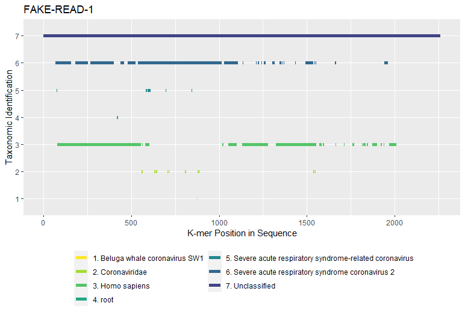

# krakenreports

## How to install: 

Create a conda environment and then run the following

```
sbatch -p NMLResearch -c 1 --mem=4G --wrap="wget -O - https://raw.githubusercontent.com/TheZetner/krakenreports/master/inst/exec/install.sh | bash"
```
* Sbatch is only necessary on slurm system
* Runs install.sh which does the following
    * Installs...
        * kraken2 from bioconda
        * r-base from r
        * r-base from r
        * r-essentials from conda-forge
        * r-xml from conda-forge
    * Installs R Packages Remotes(CRAN) and Krakenreports(Github)
    * Copies executable scripts to the bin/ folder of your Conda environment

### Executable Scripts

`runkraken.sh` to run kraken2 via sbatch on a folder of fastq files  
`krakenreports.R` to create plots and reports of the results  


## Results

### Two Tables of Results
 * `<PREFIX>_perseq.csv` - Identified k-mer counts by taxonomy per read sequence
 * `<PREFIX>_allseq.csv` - Identified k-mer counts by taxonomy for all

### Plot



## Assorted Miscellaneous Ideas

Install alone via remotes:
```
Rscript --vanilla -e 'remotes::install_github("TheZetner/krakenreports")'
```


Sometimes it's worth linking files:
```
for i in `ls ../../<FOLDEROFFILES>/*-kraken.tsv`; do ln -s $i ./; done
```
 
Searching for human (9606) reads in kraken2 output:
```
grep -P "\s+9606\s+" -H *-kraken.tsv > human.tsv
```
